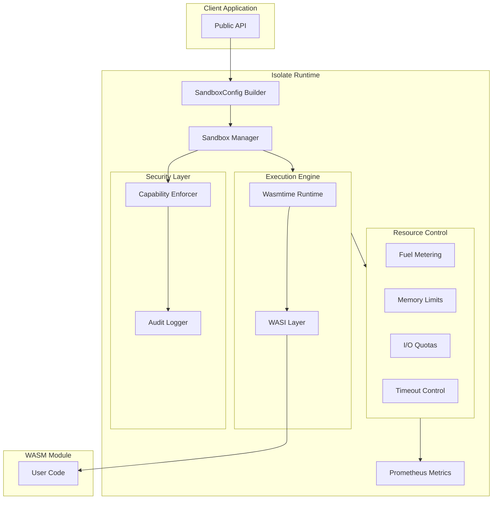
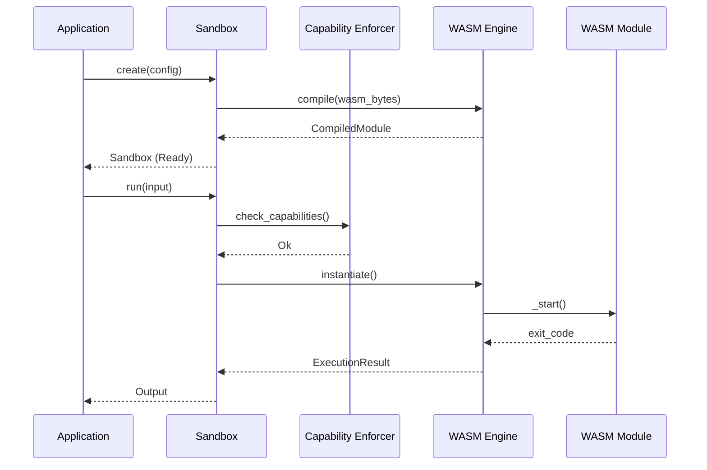

# Isolate: Secure Sandbox Runtime

[](https://github.com/josedab/isolate/actions)
[](https://github.com/josedab/isolate/actions)
[](https://codecov.io/gh/josedab/isolate)
[](https://deps.rs/repo/github/josedab/isolate)
[](https://crates.io/crates/isolate-core)
[](https://docs.rs/isolate-core)
[](LICENSE-MIT)
[](https://blog.rust-lang.org/2023/12/28/Rust-1.75.0.html)

A lightweight, secure sandbox runtime written in Rust for executing untrusted WASM code with strong isolation guarantees.

## Features

| Production Ready | Experimental |
|:-----------------|:-------------|
| Core sandbox, capabilities, resource limits, metrics, pool, networking, policy engine | Snapshots, WASI Preview2, GPU, distributed mesh, hot-patching, enclave, chaos testing |

- **Fast Cold Start**: <5ms sandbox creation (vs 125ms+ for microVMs)
- **Memory Safety**: Rust implementation eliminates runtime vulnerabilities
- **Multi-Language**: Execute any WASM-compiled language (Rust, C/C++, Go, AssemblyScript, etc.)
- **Capability-Based Security**: Fine-grained permission control with default-deny
- **Resource Limits**: CPU, memory, I/O quotas with enforcement
- **Snapshot/Restore**: Sub-millisecond warm starts

## Quick Start

> ⏱️ **First build:** ~2 minutes · **Hot rebuild:** ~5 seconds · **Run example:** instant

### Try It Now

```bash
git clone https://github.com/josedab/isolate.git && cd isolate
cargo run --package isolate-core --example basic_sandbox
```

### Installation

```bash
cargo add isolate-core
```

### Basic Usage

```rust
use isolate_core::{Sandbox, SandboxConfig, capability::Capability};

#[tokio::main]
async fn main() -> isolate_core::Result<()> {
    // Load a WASM module
    let wasm_bytes = std::fs::read("module.wasm")?;

    // Configure the sandbox with capabilities and limits
    let config = SandboxConfig::builder()
        .module(&wasm_bytes)?
        .memory_limit(128 * 1024 * 1024)  // 128MB
        .cpu_time_limit(std::time::Duration::from_secs(30))
        .capability(Capability::stdout())
        .capability(Capability::stderr())
        .build()?;

    // Create and run the sandbox
    let mut sandbox = Sandbox::create(config).await?;
    let output = sandbox.run(&[]).await?;

    println!("Exit code: {}", output.exit_code);
    println!("Stdout: {}", String::from_utf8_lossy(&output.stdout));

    Ok(())
}
```

## Architecture



### Execution Flow



## Capability System

Isolate uses a capability-based security model with default-deny:

```rust
use isolate_core::capability::*;

let config = SandboxConfig::builder()
    .module(&wasm_bytes)?
    // Filesystem: read-only access to /data
    .capability(Capability::filesystem_read("/data"))
    // Network: HTTP client to specific hosts
    .capability(Capability::http_client(vec!["api.example.com"]))
    // Environment: specific variables only
    .capability(Capability::env_var("API_KEY"))
    .build()?;
```

## Resource Limits

Control CPU, memory, and I/O usage:

```rust
let config = SandboxConfig::builder()
    .module(&wasm_bytes)?
    // Memory limits
    .memory_limit(128 * 1024 * 1024)      // 128MB heap
    .stack_size(1024 * 1024)               // 1MB stack
    // CPU limits
    .fuel(1_000_000)                       // Instruction fuel
    .cpu_time_limit(Duration::from_secs(30))
    // Timeouts
    .wall_time_limit(Duration::from_secs(60))
    .build()?;
```

## CLI Usage

```bash
# Run a WASM module
isolate run module.wasm

# Run with capabilities
isolate run module.wasm \
    --cap-fs-read /data \
    --cap-http api.example.com \
    --memory-limit 128M \
    --timeout 30s

# Run with input
echo "input data" | isolate run module.wasm
```

## gRPC Server

Start the gRPC server for remote sandbox management:

```bash
isolate-server --addr 0.0.0.0:50051
```

## Experimental Features

The following modules are included but considered **experimental** and not production-ready. Their APIs may change significantly in future releases:

| Module | Description | Status |
|--------|-------------|--------|
| `gpu` | WebGPU sandboxed compute | Simplified simulation |
| `mesh` | Distributed sandbox clustering | Network stubs only |
| `enclave` | TEE integration (SGX/SEV/TrustZone) | Simulated TEE |
| `hotpatch` | Hot code patching | Simulation only |
| `verify` | Formal verification | Simplified methods |
| `security` | Linux seccomp/Landlock | Skeleton implementation |

These modules are exported for early feedback and experimentation. Do not rely on them for production workloads.

## Documentation

Generate and view the API documentation:

```bash
cargo doc --open --no-deps
```

## Security Model

Isolate provides defense-in-depth security:

1. **WASM Sandbox**: Linear memory isolation, type-safe calls, validated bytecode
2. **Capability System**: Default deny, explicit grants, audit logging
3. **Resource Limits**: Fuel metering, memory bounds, time limits
4. **OS Isolation** (Linux): seccomp-bpf, Landlock LSM, namespaces

## Performance Targets

| Metric | Target |
|--------|--------|
| Cold Start (p50) | <3ms |
| Cold Start (p99) | <5ms |
| Warm Start (p50) | <500us |
| Warm Start (p99) | <1ms |
| Memory Overhead | <5MB |

## Development

### Prerequisites

- Rust 1.75.0 or later
- [just](https://github.com/casey/just) (optional, for task running)
- Python 3.9+ with development headers (optional, only for `isolate-python` bindings)

> **Note:** The `isolate-python` crate requires a Python development environment and is
> excluded from the default workspace build. Standard `cargo build` and `cargo test`
> work without Python installed. To include Python bindings, use `cargo test --workspace`.

### Quick Commands

```bash
# Run all checks
just check

# Run tests (default members, no Python dependency required)
cargo test

# Run tests including Python bindings (requires python3-dev)
cargo test --workspace --all-features

# Run benchmarks
cargo bench --package isolate-core

# Run clippy
cargo clippy --all-targets --all-features -- -D warnings

# Generate docs
cargo doc --no-deps --all-features --open
```

### Running Fuzz Tests

```bash
# Install cargo-fuzz (requires nightly)
cargo +nightly install cargo-fuzz

# Run a fuzz target
cd fuzz
cargo +nightly fuzz run fuzz_wasm_module
```

## Contributing

We welcome contributions! Please see [CONTRIBUTING.md](CONTRIBUTING.md) for guidelines.

### Good First Issues

Look for issues labeled [`good first issue`](https://github.com/josedab/isolate/labels/good%20first%20issue) to get started.

## Comparison with Alternatives

| Feature | Isolate | Wasmtime (bare) | microVMs |
|---------|---------|-----------------|----------|
| Cold Start | <5ms | <5ms | 125ms+ |
| Memory Overhead | <5MB | ~2MB | 128MB+ |
| Capability System | Built-in | Manual | Varies |
| Resource Metering | Built-in | Manual | OS-level |
| Multi-tenant | Yes | Manual | Yes |
| Language | Rust | Rust | Various |

## License

MIT OR Apache-2.0

## Acknowledgments

Built on top of the excellent [Wasmtime](https://wasmtime.dev/) runtime by the Bytecode Alliance.
