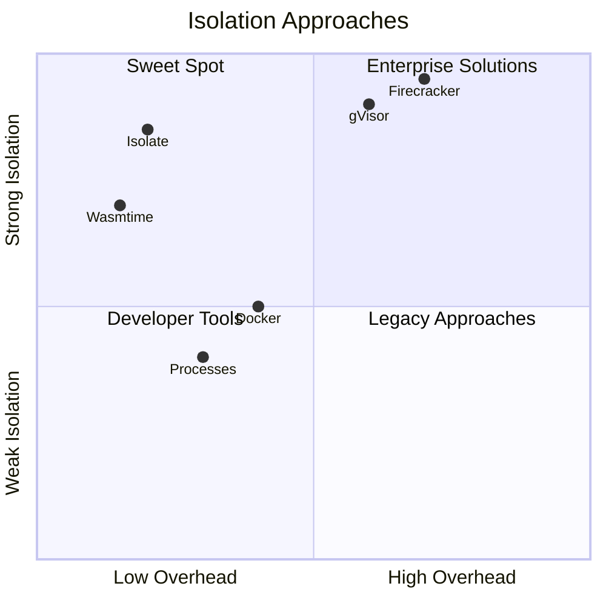
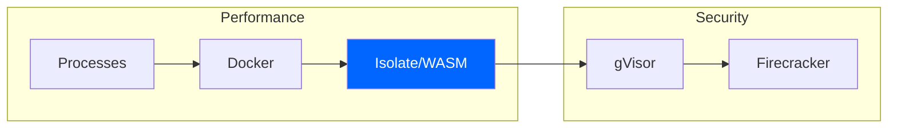
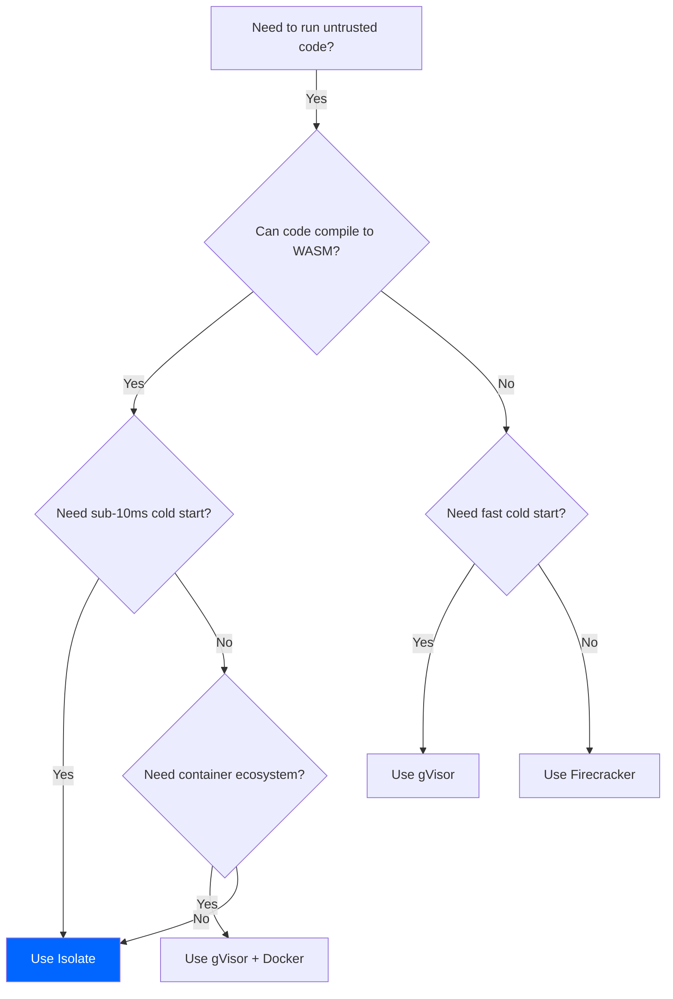

# Comparison Overview

Isolate occupies a unique position in the sandbox ecosystem. This section compares Isolate to alternative approaches for running untrusted code.

## The Isolation Landscape



## Quick Comparison

| Feature | Isolate | Wasmtime | Firecracker | gVisor | Docker |
|---------|---------|----------|-------------|--------|--------|
| Cold start | &lt;5ms | &lt;5ms | ~125ms | ~50ms | ~500ms |
| Memory overhead | ~1MB | ~1MB | ~5MB | ~15MB | ~50MB |
| Isolation level | WASM + Caps | WASM | VM | Kernel | Namespace |
| Language support | Any→WASM | Any→WASM | Any | Any | Any |
| Resource control | Fine-grained | Basic | VM-level | Syscall | cgroups |
| Security model | Capability | Minimal | Hardware | Syscall filter | Namespace |

## When to Use Isolate

### Use Isolate When You Need

1. **Fast cold starts** - Sub-5ms sandbox creation
2. **Fine-grained control** - Capability-based permissions
3. **Resource metering** - Track exact CPU and memory usage
4. **Language flexibility** - Run any WASM-compiled language
5. **Embeddable runtime** - Library that integrates into your app

### Consider Alternatives When

1. **Running native binaries** - Use Firecracker or gVisor
2. **Container orchestration** - Use Kubernetes with gVisor
3. **Full OS isolation** - Use Firecracker microVMs
4. **Existing Docker workflows** - Add gVisor for security

## Isolation Levels Explained

### Level 1: Process Isolation (Weakest)

```
┌─────────────────────────────────────┐
│           Host Kernel               │
├──────────┬──────────┬───────────────┤
│ Process  │ Process  │ Process       │
│ (fork)   │ (fork)   │ (fork)        │
└──────────┴──────────┴───────────────┘
```

- Relies on kernel for isolation
- Shared kernel attack surface
- Easy to escape with kernel exploits

### Level 2: Container Isolation

```
┌─────────────────────────────────────┐
│           Host Kernel               │
├─────────────────────────────────────┤
│         Namespace + cgroups         │
├──────────┬──────────┬───────────────┤
│Container │Container │ Container     │
└──────────┴──────────┴───────────────┘
```

- Namespace isolation (PID, network, mount)
- Resource limits via cgroups
- Still shares kernel

### Level 3: WASM Isolation (Isolate)

```
┌─────────────────────────────────────┐
│           Host Process              │
├─────────────────────────────────────┤
│      Capability Enforcer            │
├─────────────────────────────────────┤
│      WASM Runtime (Wasmtime)        │
├──────────┬──────────┬───────────────┤
│ Sandbox  │ Sandbox  │ Sandbox       │
│ (WASM)   │ (WASM)   │ (WASM)        │
└──────────┴──────────┴───────────────┘
```

- Memory-safe sandbox
- No kernel interaction from guest
- Capability-based permissions
- Fine-grained resource control

### Level 4: Kernel Isolation (gVisor)

```
┌─────────────────────────────────────┐
│           Host Kernel               │
├─────────────────────────────────────┤
│         gVisor Sentry               │
├──────────┬──────────┬───────────────┤
│Container │Container │ Container     │
└──────────┴──────────┴───────────────┘
```

- User-space kernel implementation
- Syscall interception
- Reduced attack surface

### Level 5: Hardware Isolation (Firecracker)

```
┌─────────────────────────────────────┐
│           Host Kernel               │
├─────────────────────────────────────┤
│              KVM                    │
├──────────┬──────────┬───────────────┤
│  microVM │  microVM │  microVM      │
│ (kernel) │ (kernel) │ (kernel)      │
└──────────┴──────────┴───────────────┘
```

- Hardware virtualization (Intel VT-x/AMD-V)
- Each VM has own kernel
- Strongest isolation

## Performance vs Security Tradeoff



Isolate provides an excellent balance:
- **Performance** comparable to bare processes
- **Security** approaching VM-level isolation
- **Flexibility** of capability-based permissions

## Decision Tree



## See Also

- [Isolate vs Wasmtime](./vs-wasmtime) - Detailed WASM runtime comparison
- [Isolate vs MicroVMs](./vs-microvms) - VM-based isolation comparison
