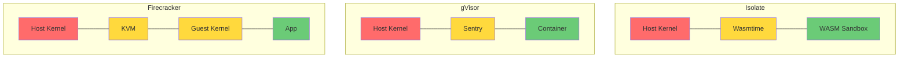

# Isolate vs MicroVMs

This page compares Isolate's WASM-based isolation with VM-based approaches like Firecracker and gVisor.

## Overview

| Aspect | Isolate | Firecracker | gVisor |
|--------|---------|-------------|--------|
| Technology | WASM sandbox | microVM | User-space kernel |
| Cold start | &lt;5ms | ~125ms | ~50ms |
| Memory overhead | ~1MB | ~5MB | ~15MB |
| Isolation | WASM + Capabilities | Hardware (KVM) | Syscall interception |
| Languages | WASM-compiled | Any | Any |
| Compatibility | WASI | Full Linux | Most Linux |

## Firecracker

[Firecracker](https://firecracker-microvm.github.io/) is a microVM manager used by AWS Lambda and Fargate.

### How Firecracker Works

```
┌─────────────────────────────────────┐
│           Host Kernel               │
├─────────────────────────────────────┤
│         KVM Hypervisor              │
├──────────┬──────────┬───────────────┤
│  microVM │  microVM │  microVM      │
│  ┌─────┐ │  ┌─────┐ │  ┌─────┐      │
│  │Guest│ │  │Guest│ │  │Guest│      │
│  │Kern.│ │  │Kern.│ │  │Kern.│      │
│  └─────┘ │  └─────┘ │  └─────┘      │
│  │ App │ │  │ App │ │  │ App │      │
└──────────┴──────────┴───────────────┘
```

**Pros:**
- Hardware-enforced isolation (strongest)
- Run any Linux binary
- Full OS compatibility
- Proven at massive scale (AWS)

**Cons:**
- 125ms+ cold start
- 5MB+ memory per VM
- Requires KVM (Linux only)
- Heavy operational overhead

### Firecracker vs Isolate

```rust
// Firecracker: Requires VM boot + kernel init
// Cold start: ~125ms

// Isolate: Direct WASM execution
// Cold start: under 5ms

// 25x faster cold starts with Isolate
```

**Use Firecracker when:**
- Running unmodified Linux binaries
- Need strongest possible isolation
- Cold start time isn't critical
- Have VM infrastructure in place

**Use Isolate when:**
- Can compile to WASM
- Need fast cold starts
- Running many concurrent sandboxes
- Want simpler operational model

## gVisor

[gVisor](https://gvisor.dev/) intercepts syscalls and implements them in user-space.

### How gVisor Works

```
┌─────────────────────────────────────┐
│           Host Kernel               │
├─────────────────────────────────────┤
│     gVisor Sentry (User-space)      │
│     ┌───────────────────────┐       │
│     │   Syscall Handler     │       │
│     │   (Go implementation) │       │
│     └───────────────────────┘       │
├──────────┬──────────┬───────────────┤
│Container │Container │ Container     │
│  │ App │ │  │ App │ │  │ App │      │
└──────────┴──────────┴───────────────┘
```

**Pros:**
- Better than container-only isolation
- Works with Docker/Kubernetes
- Runs any Linux binary
- No hardware virtualization required

**Cons:**
- ~50ms cold start
- 15MB+ memory overhead
- Syscall compatibility gaps
- Performance overhead on syscalls

### gVisor vs Isolate

| Scenario | gVisor | Isolate |
|----------|--------|---------|
| Cold start | ~50ms | &lt;5ms |
| Memory per sandbox | ~15MB | ~1MB |
| Syscall overhead | High | N/A (WASI) |
| Native binary support | Yes | No (WASM only) |
| Docker integration | Excellent | N/A |

**Use gVisor when:**
- Already using Docker/Kubernetes
- Need to run existing containers securely
- Can't recompile code to WASM
- Want drop-in security upgrade

**Use Isolate when:**
- Building from scratch
- Can compile to WASM
- Need minimal overhead
- Want embedded sandbox

## Performance Comparison

### Cold Start Benchmark

```
Isolate:      ████ 4ms
gVisor:       ████████████████████████████████████████████████ 48ms
Firecracker:  ████████████████████████████████████████████████████████████████████████████████████████████████████████████████████████████ 125ms
```

### Memory Overhead

```
Isolate:      █ 1MB
Firecracker:  █████ 5MB
gVisor:       ███████████████ 15MB
```

### Requests per Second (Hello World)

```
Isolate:      ████████████████████████████████████████████████████████████████████████████████████████████████████████ 50,000 RPS
gVisor:       ████████████████████████████████████████████████████████████████████████ 35,000 RPS
Firecracker:  ████████████████████████████████████████████████ 25,000 RPS
```

*Benchmark on AWS c5.xlarge, single core*

## Security Comparison

### Attack Surface



| Component | Isolate | gVisor | Firecracker |
|-----------|---------|--------|-------------|
| Host kernel exposure | Minimal (via Wasmtime) | Minimal (via Sentry) | Minimal (via KVM) |
| Attack surface size | Small (~100K LOC) | Medium (~500K LOC) | Small (KVM) + Large (guest kernel) |
| Language safety | Rust (memory-safe) | Go (memory-safe) | C (guest kernel) |

### Escape Difficulty

**Isolate escape requires:**
1. WASM sandbox escape (very hard)
2. Wasmtime vulnerability (rare)
3. Host kernel exploit (standard)

**gVisor escape requires:**
1. Sentry vulnerability (medium)
2. Host kernel exploit (standard)

**Firecracker escape requires:**
1. Guest kernel exploit (common)
2. KVM vulnerability (rare)
3. Host kernel exploit (standard)

## Use Case Decision Matrix

| Use Case | Best Choice | Reason |
|----------|-------------|--------|
| Serverless functions (WASM) | **Isolate** | Fast cold start, low overhead |
| Serverless functions (native) | Firecracker | Full compatibility |
| Multi-tenant SaaS | **Isolate** | Many concurrent sandboxes |
| Container security | gVisor | Docker/K8s integration |
| Edge computing | **Isolate** | Minimal footprint |
| Legacy app isolation | Firecracker | No code changes |
| Plugin systems | **Isolate** | Embeddable, fast |
| CI/CD runners | gVisor | Container ecosystem |

## Hybrid Approaches

You can combine approaches for defense in depth:

### Isolate + Firecracker

```
┌─────────────────────────────────────┐
│           Host Kernel               │
├─────────────────────────────────────┤
│              KVM                    │
├─────────────────────────────────────┤
│           Firecracker VM            │
│  ┌─────────────────────────────┐    │
│  │      Isolate Runtime        │    │
│  │  ┌────────┬────────┬─────┐  │    │
│  │  │ WASM   │ WASM   │WASM │  │    │
│  │  │Sandbox │Sandbox │Sand.│  │    │
│  │  └────────┴────────┴─────┘  │    │
│  └─────────────────────────────┘    │
└─────────────────────────────────────┘
```

**Benefits:**
- Hardware isolation at VM layer
- Fast sandboxes within VM
- Limited blast radius

### Isolate + gVisor

```
┌─────────────────────────────────────┐
│           Host Kernel               │
├─────────────────────────────────────┤
│          gVisor Sentry              │
├─────────────────────────────────────┤
│      gVisor Container               │
│  ┌─────────────────────────────┐    │
│  │      Isolate Runtime        │    │
│  │  ┌────────┬────────┬─────┐  │    │
│  │  │ WASM   │ WASM   │WASM │  │    │
│  │  │Sandbox │Sandbox │Sand.│  │    │
│  │  └────────┴────────┴─────┘  │    │
│  └─────────────────────────────┘    │
└─────────────────────────────────────┘
```

**Benefits:**
- Syscall interception as outer layer
- Fast sandboxes within container
- Works with existing K8s infrastructure

## Summary

| Factor | Winner |
|--------|--------|
| Cold start | **Isolate** |
| Memory efficiency | **Isolate** |
| Strongest isolation | **Firecracker** |
| Compatibility | **Firecracker** |
| K8s integration | **gVisor** |
| Operational simplicity | **Isolate** |
| Concurrent sandboxes | **Isolate** |

**Choose Isolate** for fast, efficient sandboxing when code can compile to WASM.

**Choose Firecracker** for maximum isolation of untrusted native code.

**Choose gVisor** for securing existing container workloads in Kubernetes.
