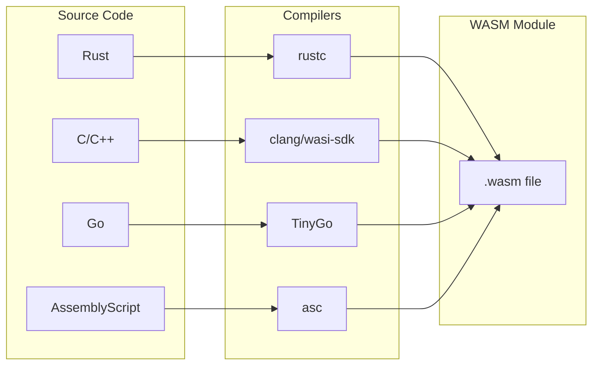

# Building WASM Modules

This guide explains how to compile code from various languages to WebAssembly for use with Isolate.

## Overview

Isolate runs WebAssembly modules that target **WASI** (WebAssembly System Interface). WASI provides a standardized way for WASM modules to interact with the outside world (files, environment, etc.).



## Rust

Rust has first-class WebAssembly support and is the recommended language for Isolate modules.

### Setup

```bash
# Add the WASI target
rustup target add wasm32-wasip1
```

### Minimal Example

```rust
// src/main.rs
fn main() {
    println!("Hello from WASM!");
}
```

```toml
# Cargo.toml
[package]
name = "my-module"
version = "0.1.0"
edition = "2021"

[profile.release]
opt-level = "z"     # Optimize for size
lto = true          # Link-time optimization
strip = true        # Strip symbols
```

### Build

```bash
cargo build --release --target wasm32-wasip1
# Output: target/wasm32-wasip1/release/my-module.wasm
```

### Data Processing Example

```rust
use std::io::{self, BufRead, Write};
use serde::{Deserialize, Serialize};

#[derive(Deserialize)]
struct Input {
    numbers: Vec<i32>,
}

#[derive(Serialize)]
struct Output {
    sum: i32,
    count: usize,
}

fn main() -> io::Result<()> {
    // Read JSON from stdin
    let stdin = io::stdin();
    let input: Input = serde_json::from_reader(stdin.lock())?;

    // Process
    let output = Output {
        sum: input.numbers.iter().sum(),
        count: input.numbers.len(),
    };

    // Write JSON to stdout
    serde_json::to_writer(io::stdout(), &output)?;
    Ok(())
}
```

```toml
# Cargo.toml dependencies
[dependencies]
serde = { version = "1.0", features = ["derive"] }
serde_json = "1.0"
```

### Optimization

```bash
# Install wasm-opt (from binaryen)
brew install binaryen  # macOS
apt install binaryen   # Ubuntu

# Optimize the module
wasm-opt -Oz -o optimized.wasm target/wasm32-wasip1/release/my-module.wasm

# Check sizes
ls -la *.wasm
```

Typical size reduction: 50-70% smaller after optimization.

## C/C++

Use the WASI SDK for C/C++ compilation.

### Setup

```bash
# Download WASI SDK
export WASI_VERSION=20
export WASI_VERSION_FULL=${WASI_VERSION}.0
wget https://github.com/WebAssembly/wasi-sdk/releases/download/wasi-sdk-${WASI_VERSION}/wasi-sdk-${WASI_VERSION_FULL}-linux.tar.gz
tar xvf wasi-sdk-${WASI_VERSION_FULL}-linux.tar.gz

export WASI_SDK_PATH=/path/to/wasi-sdk-${WASI_VERSION_FULL}
```

### Minimal Example

```c
// hello.c
#include <stdio.h>

int main() {
    printf("Hello from C!\n");
    return 0;
}
```

### Build

```bash
$WASI_SDK_PATH/bin/clang hello.c -o hello.wasm
```

### With Optimization

```bash
$WASI_SDK_PATH/bin/clang \
    -O3 \
    -flto \
    -Wl,--strip-all \
    hello.c -o hello.wasm
```

### C++ Example

```cpp
// processor.cpp
#include <iostream>
#include <vector>
#include <numeric>

int main() {
    std::vector<int> numbers;
    int n;

    while (std::cin >> n) {
        numbers.push_back(n);
    }

    int sum = std::accumulate(numbers.begin(), numbers.end(), 0);
    std::cout << "Sum: " << sum << std::endl;

    return 0;
}
```

```bash
$WASI_SDK_PATH/bin/clang++ \
    -O3 \
    -std=c++17 \
    processor.cpp -o processor.wasm
```

## Go

Use TinyGo for smaller, WASI-compatible modules.

:::warning
Standard Go's WASM output is large (~2MB+). Use TinyGo for Isolate.
:::

### Setup

```bash
# Install TinyGo
# macOS
brew install tinygo

# Linux (download from https://tinygo.org/getting-started/install/)
wget https://github.com/tinygo-org/tinygo/releases/download/v0.30.0/tinygo_0.30.0_amd64.deb
sudo dpkg -i tinygo_0.30.0_amd64.deb
```

### Minimal Example

```go
// main.go
package main

import "fmt"

func main() {
    fmt.Println("Hello from Go!")
}
```

### Build

```bash
tinygo build -o hello.wasm -target=wasi main.go
```

### Data Processing Example

```go
// processor.go
package main

import (
    "bufio"
    "encoding/json"
    "fmt"
    "os"
)

type Input struct {
    Values []int `json:"values"`
}

type Output struct {
    Sum     int `json:"sum"`
    Average float64 `json:"average"`
}

func main() {
    // Read JSON from stdin
    scanner := bufio.NewScanner(os.Stdin)
    scanner.Scan()

    var input Input
    if err := json.Unmarshal(scanner.Bytes(), &input); err != nil {
        fmt.Fprintln(os.Stderr, "Error:", err)
        os.Exit(1)
    }

    // Process
    sum := 0
    for _, v := range input.Values {
        sum += v
    }

    output := Output{
        Sum:     sum,
        Average: float64(sum) / float64(len(input.Values)),
    }

    // Write JSON to stdout
    json.NewEncoder(os.Stdout).Encode(output)
}
```

```bash
tinygo build -o processor.wasm -target=wasi processor.go
```

### Optimization Flags

```bash
tinygo build \
    -o optimized.wasm \
    -target=wasi \
    -opt=z \
    -no-debug \
    main.go
```

## AssemblyScript

TypeScript-like syntax that compiles directly to WebAssembly.

### Setup

```bash
npm init -y
npm install --save-dev assemblyscript
npx asinit .
```

### Minimal Example

```typescript
// assembly/index.ts
export function main(): void {
    console.log("Hello from AssemblyScript!");
}
```

### Build

```bash
npm run asbuild
# Output: build/release.wasm
```

### Configuration

```json
// asconfig.json
{
  "targets": {
    "release": {
      "outFile": "build/release.wasm",
      "optimize": true,
      "noAssert": true
    }
  }
}
```

### Processing Example

```typescript
// assembly/index.ts
import { JSON } from "assemblyscript-json";

export function processData(inputPtr: i32, inputLen: i32): i32 {
    // Read input string
    const input = String.UTF8.decodeUnsafe(inputPtr, inputLen);

    // Parse JSON
    const data = <JSON.Obj>JSON.parse(input);
    const values = data.getArr("values")!;

    // Calculate sum
    let sum: i32 = 0;
    for (let i = 0; i < values.valueOf().length; i++) {
        sum += (<JSON.Integer>values.valueOf()[i]).valueOf() as i32;
    }

    // Return result (or write to memory)
    return sum;
}
```

## Python (via MicroPython)

Run Python code in WASM using MicroPython.

### Using Pre-built MicroPython

```bash
# Download pre-built MicroPython WASM
wget https://micropython.org/resources/firmware/micropython-wasm-1.21.0.wasm
```

### Running Python Code

Pass Python code as input to the MicroPython interpreter:

```rust
let config = SandboxConfig::builder()
    .module(&micropython_wasm)?
    .capability(Capability::stdout())
    .capability(Capability::stdin())
    .build()?;

let mut sandbox = Sandbox::create(config).await?;
let python_code = b"print('Hello from Python!')";
let output = sandbox.run(python_code).await?;
```

## Module Validation

### Validate Before Deployment

```bash
# Using wasmtime
wasmtime compile module.wasm  # Checks validity

# Using wasm-tools
wasm-tools validate module.wasm

# Print module info
wasm-tools print module.wasm | head -50
```

### Check WASI Compatibility

```bash
# List imports (should be WASI functions)
wasm-tools print module.wasm | grep import
```

Expected imports:
```
(import "wasi_snapshot_preview1" "fd_write" ...)
(import "wasi_snapshot_preview1" "fd_read" ...)
(import "wasi_snapshot_preview1" "proc_exit" ...)
```

## Best Practices

### 1. Minimize Module Size

| Technique | Rust | C/C++ | Go |
|-----------|------|-------|-----|
| Optimization | `-Oz` | `-O3` | `-opt=z` |
| LTO | `lto = true` | `-flto` | automatic |
| Strip symbols | `strip = true` | `--strip-all` | `-no-debug` |
| Post-process | `wasm-opt -Oz` | `wasm-opt -Oz` | `wasm-opt -Oz` |

### 2. Handle Errors Gracefully

```rust
fn main() {
    if let Err(e) = run() {
        eprintln!("Error: {}", e);
        std::process::exit(1);
    }
}

fn run() -> Result<(), Box<dyn std::error::Error>> {
    // Your logic here
    Ok(())
}
```

### 3. Use Standard I/O for Communication

```rust
// Input via stdin
let input: MyInput = serde_json::from_reader(std::io::stdin())?;

// Output via stdout
serde_json::to_writer(std::io::stdout(), &output)?;

// Errors via stderr
eprintln!("Warning: {}", message);

// Exit code indicates success/failure
std::process::exit(if success { 0 } else { 1 });
```

### 4. Document Capability Requirements

```rust
//! # My Processor Module
//!
//! ## Required Capabilities
//! - `stdout` - Writes result JSON
//! - `stderr` - Writes error messages
//! - `stdin` - Reads input JSON
//! - `system_clock` - Timestamps (optional)
//!
//! ## Resource Recommendations
//! - Memory: 64MB minimum
//! - Fuel: 10M for typical workloads
```

### 5. Test Locally First

```bash
# Test with wasmtime
echo '{"values": [1, 2, 3]}' | wasmtime run processor.wasm

# Test with Isolate CLI
echo '{"values": [1, 2, 3]}' | isolate run processor.wasm --cap-stdout --cap-stdin
```

## Troubleshooting

### "Cannot find _start function"

Your module needs a `_start` entry point (provided by `main` in most languages).

```rust
// Rust: use main()
fn main() { }

// If using #![no_main], define _start manually
#[no_mangle]
pub extern "C" fn _start() { }
```

### "Unsupported WASI import"

Your module uses a WASI function that Isolate doesn't implement. Check:
1. You're targeting `wasi_snapshot_preview1`
2. The function is supported by Wasmtime

### "Module too large"

Apply optimization techniques:
```bash
# Rust
cargo build --release
wasm-opt -Oz input.wasm -o output.wasm

# Size check
ls -la *.wasm
```

### "Out of memory" during compilation

Your module's memory requirements may be too high. Check:
1. Static data size
2. Stack size requirements
3. Linear memory minimum

## See Also

- [Quick Start](../getting-started/quick-start) - Running your first module
- [Capabilities](./capabilities) - Understanding permissions
- [Resource Limits](./resource-limits) - Memory and CPU limits
- [Benchmarks](../reference/benchmarks) - Performance data
