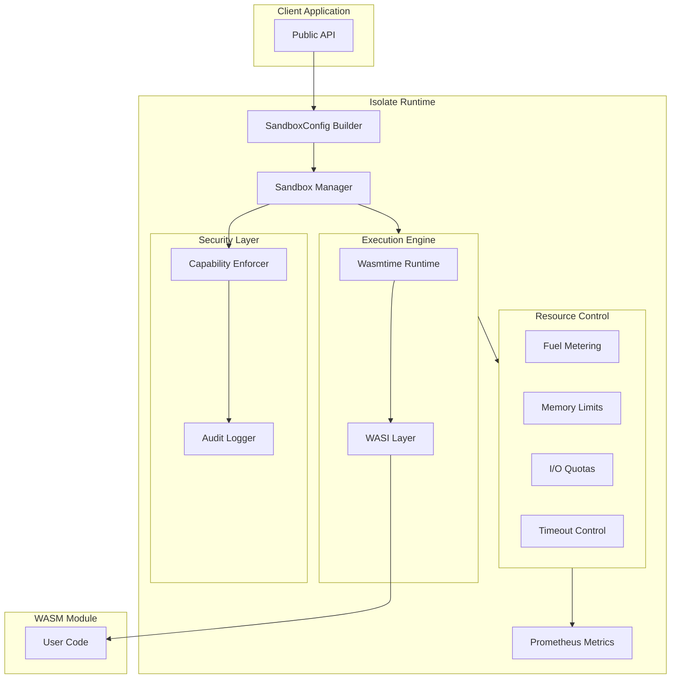
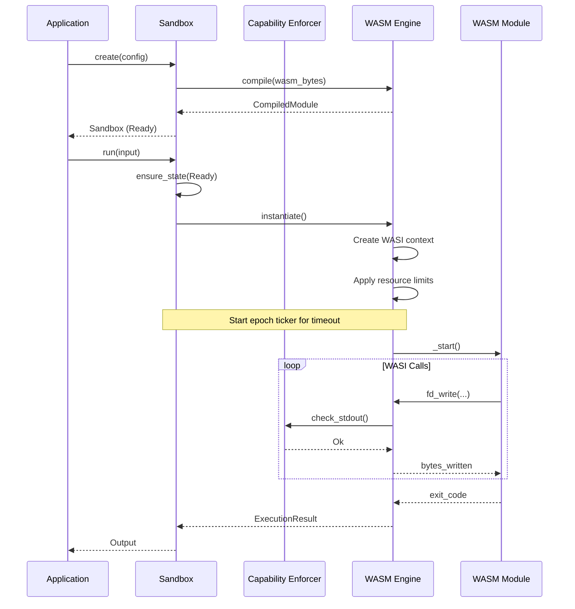

# Architecture

This document describes the internal architecture of Isolate, useful for contributors and those wanting to understand how the system works.

## High-Level Overview



## Component Overview

### Sandbox (`sandbox.rs`)

The main entry point for creating and running isolated WASM code.

**Responsibilities:**
- Lifecycle management (create, run, terminate)
- State machine enforcement
- Coordinating other components

**Key types:**
- `Sandbox` - Main sandbox struct
- `SandboxId` - Unique identifier
- `SandboxState` - State enum
- `Output` - Execution results

### Configuration (`config.rs`)

Builder pattern for sandbox configuration.

**Responsibilities:**
- Validating configuration
- Storing resource limits and capabilities
- Module hash computation

**Key types:**
- `SandboxConfig` - Immutable configuration
- `SandboxConfigBuilder` - Fluent builder
- `ResourceLimits` - Limit settings

### WasmEngine (`engine/wasm.rs`)

Wasmtime integration with module caching.

**Responsibilities:**
- Module compilation and caching
- Instance creation
- Epoch management for timeouts

**Key types:**
- `WasmEngine` - Shared engine
- `CompiledModule` - Cached compiled module
- `WasmInstance` - Runtime instance

### Capability System (`capability/`)

Permission-based security model.

**Responsibilities:**
- Defining capability types
- Enforcing permissions at runtime
- Audit logging

**Key types:**
- `Capability` - Permission enum
- `CapabilityEnforcer` - Runtime enforcement
- `AuditLogger` - Security logging

### Resource Metering (`resource/`)

Resource usage tracking and limiting.

**Responsibilities:**
- Tracking fuel consumption
- Monitoring memory usage
- Enforcing I/O limits

**Key types:**
- `ResourceMeter` - Usage tracker
- `ResourceUsage` - Usage report
- `ResourceLimits` - Limit configuration

## Execution Flow



## Module Caching

The `WasmEngine` caches compiled modules keyed by their SHA-256 hash:

```
Module bytes → SHA-256 hash → Lookup in cache
                                 ↓
                            Cache hit? → Return cached module
                                 ↓ No
                            Compile → Store in cache → Return
```

Benefits:
- Avoid recompilation of the same module
- Shared across multiple sandboxes
- Automatic deduplication

## Timeout Implementation

Timeouts use Wasmtime's epoch-based interruption:

1. Configure epoch deadline on store
2. Spawn background task to increment epochs every 10ms
3. Wasmtime checks epoch at function calls and loop backedges
4. Trap raised when deadline exceeded
5. Cancel background task after execution

```rust
// Simplified implementation
let epochs_until_timeout = timeout_ms / 10;
store.set_epoch_deadline(epochs_until_timeout);

let ticker = tokio::spawn(async move {
    loop {
        tokio::time::sleep(Duration::from_millis(10)).await;
        engine.increment_epoch();
    }
});

// Run WASM...

ticker.abort();
```

## WASI Integration

Isolate uses WASI preview1 for system interface:

```
┌─────────────────────────────────────────┐
│           WASM Module                    │
├─────────────────────────────────────────┤
│           WASI preview1                  │
│  ┌─────────┬─────────┬─────────┐        │
│  │ fd_*    │ clock_* │ random_*│        │
│  └────┬────┴────┬────┴────┬────┘        │
├───────┼─────────┼─────────┼─────────────┤
│       │         │         │             │
│  ┌────▼────┐┌───▼───┐┌────▼────┐        │
│  │Capability││Capabil││Capability│       │
│  │ Check   ││ Check ││ Check   │        │
│  └────┬────┘└───┬───┘└────┬────┘        │
│       │         │         │             │
│  ┌────▼────┐┌───▼───┐┌────▼────┐        │
│  │ Capture ││ Host  ││ Host    │        │
│  │ Stream  ││ Clock ││ Random  │        │
│  └─────────┘└───────┘└─────────┘        │
└─────────────────────────────────────────┘
```

## Memory Layout

Each sandbox has isolated memory:

```
┌─────────────────────────────────────────┐
│           Linear Memory                  │
│  ┌─────────────────────────────────────┐│
│  │ Heap (grows up)                     ││
│  │ limit: memory_limit                 ││
│  ├─────────────────────────────────────┤│
│  │ Stack (grows down)                  ││
│  │ limit: stack_size                   ││
│  ├─────────────────────────────────────┤│
│  │ Globals                             ││
│  └─────────────────────────────────────┘│
└─────────────────────────────────────────┘
```

Memory isolation is enforced by:
1. WASM's linear memory model (bounds-checked access)
2. Wasmtime's `StoreLimits` (allocation limits)
3. OS-level protection (mmap with guards)

## Thread Safety

- `WasmEngine` is `Send + Sync` (can be shared across threads)
- `Sandbox` is `Send` but not `Sync` (move between threads, not shared)
- `CapabilityEnforcer` is cloned per-sandbox
- `ResourceMeter` uses atomic operations

## Error Propagation

Errors flow through the system:

```
WASM trap → Wasmtime error → isolate Error → Result<T, Error>
```

Error categories:
- **Module errors**: Invalid WASM, compilation failures
- **Runtime errors**: Traps, timeouts, resource limits
- **Security errors**: Capability denials
- **I/O errors**: File system, network failures

## See Also

- [WASM Engine](./wasm-engine) - Detailed engine documentation
- [Capability System](./capability-system) - Security implementation
- [Contributing](../contributing) - How to contribute
