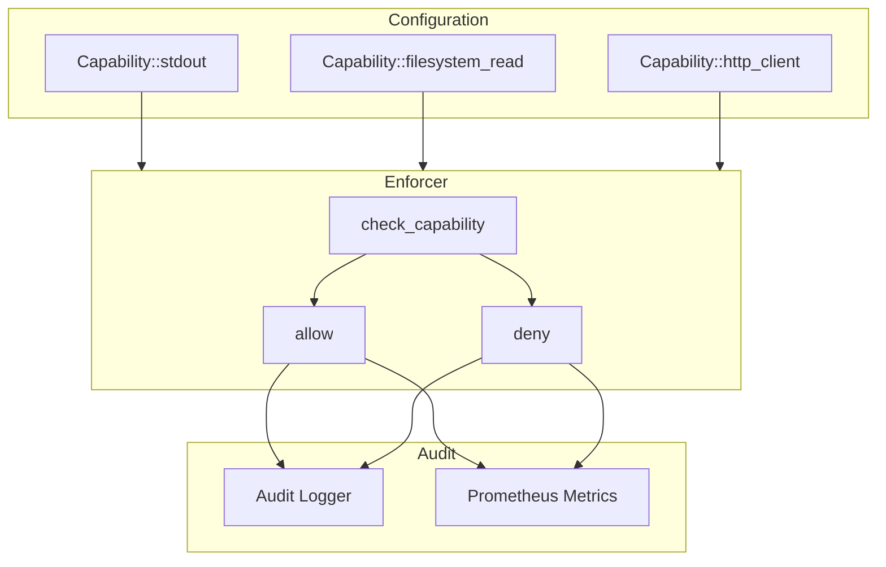

# Capability System

The capability system implements fine-grained, default-deny security. This document explains its internal implementation.

## Design Principles

1. **Default Deny** - No access unless explicitly granted
2. **Principle of Least Privilege** - Grant minimum necessary
3. **Auditable** - All checks are logged
4. **Composable** - Capabilities can be combined
5. **Type-Safe** - Compile-time capability definitions

## Architecture



## Capability Types

```rust
#[derive(Debug, Clone, PartialEq, Eq, Hash)]
pub enum Capability {
    Stdio(StdioCapability),
    Filesystem(FilesystemCapability),
    Network(NetworkCapability),
    Time(TimeCapability),
    Random(RandomCapability),
    Environment(EnvironmentCapability),
    HostFunction(HostFunctionCapability),
}
```

### Filesystem Capabilities

```rust
#[derive(Debug, Clone, PartialEq, Eq, Hash)]
pub enum FilesystemCapability {
    ReadOnly(PathBuf),
    ReadWrite(PathBuf),
    TempDir,
}

impl FilesystemCapability {
    pub fn allows_read(&self, path: &Path) -> bool {
        match self {
            Self::ReadOnly(allowed) | Self::ReadWrite(allowed) => {
                path.starts_with(allowed)
            }
            Self::TempDir => false,  // Temp paths handled specially
        }
    }

    pub fn allows_write(&self, path: &Path) -> bool {
        match self {
            Self::ReadWrite(allowed) => path.starts_with(allowed),
            _ => false,
        }
    }
}
```

### Network Capabilities

```rust
#[derive(Debug, Clone, PartialEq, Eq, Hash)]
pub enum NetworkCapability {
    HttpClient(Vec<String>),  // Host patterns
    TcpConnect(Vec<SocketAddr>),
    TcpListen(u16),
    DnsResolve,
}

impl NetworkCapability {
    pub fn allows_http_host(&self, host: &str) -> bool {
        match self {
            Self::HttpClient(patterns) => {
                patterns.iter().any(|p| {
                    if p.starts_with("*.") {
                        // Wildcard: *.example.com
                        let suffix = &p[1..];
                        host.ends_with(suffix) || host == &p[2..]
                    } else {
                        host == p
                    }
                })
            }
            _ => false,
        }
    }
}
```

## Capability Enforcer

The enforcer is created for each sandbox:

```rust
pub struct CapabilityEnforcer {
    capabilities: HashSet<Capability>,
    sandbox_id: Uuid,
    audit_logger: AuditLogger,
}

impl CapabilityEnforcer {
    pub fn new(capabilities: Vec<Capability>, sandbox_id: Uuid) -> Self {
        Self {
            capabilities: capabilities.into_iter().collect(),
            sandbox_id,
            audit_logger: AuditLogger::new(),
        }
    }

    /// Check if a capability is granted
    fn has(&self, cap: &Capability) -> bool {
        self.capabilities.contains(cap)
    }
}
```

### Check Methods

Each resource type has specific check methods:

```rust
impl CapabilityEnforcer {
    pub fn check_stdout(&self) -> Result<()> {
        let cap = Capability::stdout();
        if self.has(&cap) {
            self.audit_logger.granted(self.sandbox_id, &cap);
            Ok(())
        } else {
            self.audit_logger.denied(self.sandbox_id, &cap);
            Err(Error::CapabilityDenied(cap.description()))
        }
    }

    pub fn check_fs_read(&self, path: &Path) -> Result<()> {
        for cap in &self.capabilities {
            if let Capability::Filesystem(fs_cap) = cap {
                if fs_cap.allows_read(path) {
                    self.audit_logger.granted(self.sandbox_id, cap);
                    return Ok(());
                }
            }
        }
        let cap = Capability::filesystem_read(path);
        self.audit_logger.denied(self.sandbox_id, &cap);
        Err(Error::CapabilityDenied(cap.description()))
    }

    pub fn check_http(&self, url: &Url) -> Result<()> {
        let host = url.host_str().unwrap_or("");
        for cap in &self.capabilities {
            if let Capability::Network(net_cap) = cap {
                if net_cap.allows_http_host(host) {
                    self.audit_logger.granted(self.sandbox_id, cap);
                    return Ok(());
                }
            }
        }
        let cap = Capability::http_client(vec![host.to_string()]);
        self.audit_logger.denied(self.sandbox_id, &cap);
        Err(Error::CapabilityDenied(cap.description()))
    }
}
```

## Audit Logging

All capability checks are logged:

```rust
pub struct AuditLogger {
    // ...
}

impl AuditLogger {
    pub fn granted(&self, sandbox_id: Uuid, cap: &Capability) {
        tracing::info!(
            target: "isolate::capability::audit",
            sandbox_id = %sandbox_id,
            capability = %cap.description(),
            "capability_granted"
        );

        CAPABILITY_GRANTS.with_label_values(&[&cap.category()]).inc();
    }

    pub fn denied(&self, sandbox_id: Uuid, cap: &Capability) {
        tracing::warn!(
            target: "isolate::capability::audit",
            sandbox_id = %sandbox_id,
            capability = %cap.description(),
            "capability_denied"
        );

        CAPABILITY_DENIALS.with_label_values(&[&cap.category()]).inc();
    }
}
```

## Integration with WASI

Capabilities are enforced in WASI host functions:

```rust
// In WASI implementation
fn fd_write(
    ctx: &mut WasiCtx,
    fd: u32,
    iovs: &[IoSlice],
) -> Result<usize> {
    match fd {
        1 => {  // stdout
            ctx.enforcer.check_stdout()?;
            // ... write to stdout
        }
        2 => {  // stderr
            ctx.enforcer.check_stderr()?;
            // ... write to stderr
        }
        _ => {
            let path = ctx.fd_table.get_path(fd)?;
            ctx.enforcer.check_fs_write(&path)?;
            // ... write to file
        }
    }
}
```

## Path Canonicalization

Paths are canonicalized before checking:

```rust
fn check_fs_read(&self, path: &Path) -> Result<()> {
    // Canonicalize to prevent path traversal
    let canonical = path.canonicalize()
        .map_err(|_| Error::CapabilityDenied("invalid path".into()))?;

    // Check against capabilities
    for cap in &self.capabilities {
        if let Capability::Filesystem(fs_cap) = cap {
            if fs_cap.allows_read(&canonical) {
                return Ok(());
            }
        }
    }

    Err(Error::CapabilityDenied(
        format!("filesystem_read:{}", canonical.display())
    ))
}
```

This prevents attacks like:
- `/data/../etc/passwd` → `/etc/passwd`
- `/data/./config` → `/data/config`

## Capability Composition

Capabilities can be combined:

```rust
// Builder pattern
let config = SandboxConfig::builder()
    .module(&wasm)?
    .capability(Capability::stdout())
    .capability(Capability::stderr())
    .capability(Capability::filesystem_read("/data"))
    .capabilities([
        Capability::system_clock(),
        Capability::secure_random(),
    ])
    .build()?;
```

## Performance Considerations

1. **HashSet lookup** - O(1) capability checks
2. **Path operations** - Canonicalization can be slow
3. **Logging overhead** - Async logging recommended
4. **Metrics** - Atomic counters, minimal overhead

## Testing

```rust
#[test]
fn test_filesystem_capability() {
    let cap = FilesystemCapability::ReadOnly("/data".into());

    assert!(cap.allows_read(Path::new("/data/file.txt")));
    assert!(cap.allows_read(Path::new("/data/subdir/file.txt")));
    assert!(!cap.allows_read(Path::new("/etc/passwd")));
    assert!(!cap.allows_read(Path::new("/data-other/file.txt")));

    assert!(!cap.allows_write(Path::new("/data/file.txt")));
}

#[test]
fn test_network_capability_wildcard() {
    let cap = NetworkCapability::HttpClient(vec!["*.example.com".into()]);

    assert!(cap.allows_http_host("api.example.com"));
    assert!(cap.allows_http_host("www.example.com"));
    assert!(cap.allows_http_host("example.com"));
    assert!(!cap.allows_http_host("example.org"));
}
```

## See Also

- [Capabilities Guide](../guides/capabilities) - User documentation
- [Security Model](../guides/security-model) - Security overview
- [Architecture](./architecture) - System architecture
