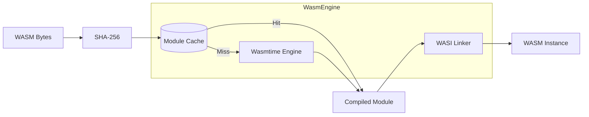

# WASM Engine

The WASM engine is responsible for compiling, caching, and executing WebAssembly modules. It's built on [Wasmtime](https://wasmtime.dev/).

## Overview



## Engine Configuration

The Wasmtime engine is configured for security and performance:

```rust
let mut config = wasmtime::Config::new();

// Security settings
config.wasm_memory_control(true);  // Memory protection
config.wasm_backtrace(true);        // Debugging

// Performance settings
config.cranelift_opt_level(OptLevel::Speed);
config.parallel_compilation(true);

// Resource control
config.consume_fuel(true);          // Enable fuel metering
config.epoch_interruption(true);    // Enable timeouts
```

## Module Caching

Modules are cached by their SHA-256 hash:

```rust
pub struct WasmEngine {
    engine: wasmtime::Engine,
    cache: DashMap<ModuleHash, CompiledModule>,
}

impl WasmEngine {
    pub fn compile(&self, config: &SandboxConfig) -> Result<CompiledModule> {
        let hash = config.module_hash();

        // Check cache first
        if let Some(cached) = self.cache.get(hash) {
            return Ok(cached.clone());
        }

        // Compile and cache
        let module = wasmtime::Module::new(&self.engine, &config.module)?;
        let compiled = CompiledModule::new(module, hash.clone());
        self.cache.insert(hash.clone(), compiled.clone());

        Ok(compiled)
    }
}
```

Benefits:
- Same module compiled once
- Shared across all sandboxes
- Thread-safe (DashMap)

## Instance Creation

Creating a WASM instance involves:

1. **Creating a Store** with resource limits
2. **Setting up WASI** context
3. **Instantiating** the module
4. **Applying** fuel and epoch settings

```rust
pub fn instantiate(
    &self,
    compiled: &CompiledModule,
    config: &SandboxConfig,
    enforcer: CapabilityEnforcer,
    meter: ResourceMeter,
) -> Result<WasmInstance> {
    // Create store with limits
    let mut store = wasmtime::Store::new(&self.engine, StoreData {
        enforcer,
        meter,
    });

    // Apply resource limits
    store.limiter(|data| &mut data.limiter);

    // Set up WASI
    let wasi = self.create_wasi_context(config)?;

    // Create linker and add WASI
    let mut linker = wasmtime::Linker::new(&self.engine);
    wasmtime_wasi::add_to_linker(&mut linker, |data| &mut data.wasi)?;

    // Instantiate
    let instance = linker.instantiate(&mut store, compiled.module())?;

    Ok(WasmInstance { store, instance })
}
```

## WASI Context

The WASI context is configured based on capabilities:

```rust
fn create_wasi_context(&self, config: &SandboxConfig) -> Result<WasiCtx> {
    let mut builder = WasiCtxBuilder::new();

    // Stdin
    if config.has_capability(Capability::stdin()) {
        builder.stdin(/* BufferedStdin */);
    } else {
        builder.stdin(/* EmptyStdin */);
    }

    // Stdout
    if config.has_capability(Capability::stdout()) {
        builder.stdout(/* CaptureStream */);
    } else {
        builder.stdout(/* NullStream */);
    }

    // Filesystem
    for cap in config.filesystem_capabilities() {
        match cap {
            FilesystemCapability::ReadOnly(path) => {
                builder.preopened_dir(path, path, DirPerms::READ)?;
            }
            FilesystemCapability::ReadWrite(path) => {
                builder.preopened_dir(path, path, DirPerms::all())?;
            }
        }
    }

    // Environment variables
    for (key, value) in config.env() {
        if config.has_capability(Capability::env_var(key)) {
            builder.env(key, value)?;
        }
    }

    // Arguments
    builder.args(config.args())?;

    builder.build()
}
```

## Fuel Metering

Fuel tracks instruction execution:

```rust
// Set initial fuel
store.add_fuel(config.fuel.unwrap_or(u64::MAX))?;

// Check remaining fuel
let remaining = store.fuel_consumed()?;

// Fuel consumption happens automatically during execution
```

Approximate fuel costs:
- Basic operations: 1 fuel
- Memory access: 1-2 fuel
- Function calls: 2-5 fuel

## Epoch Interruption

Epochs enable wall-clock timeouts:

```rust
// Configure deadline
store.epoch_deadline_trap();
store.set_epoch_deadline(epochs_until_timeout);

// Background task increments epoch
tokio::spawn(async move {
    let mut interval = tokio::time::interval(Duration::from_millis(10));
    loop {
        interval.tick().await;
        engine.increment_epoch();
    }
});

// Wasmtime checks epoch at:
// - Function calls
// - Loop back edges
// - Async yield points
```

## Memory Limits

Memory is controlled via `StoreLimits`:

```rust
struct SandboxLimiter {
    memory_limit: usize,
    memory_used: usize,
}

impl ResourceLimiter for SandboxLimiter {
    fn memory_growing(
        &mut self,
        current: usize,
        desired: usize,
        maximum: Option<usize>,
    ) -> bool {
        if desired > self.memory_limit {
            return false;  // Deny allocation
        }
        self.memory_used = desired;
        true
    }

    fn table_growing(
        &mut self,
        current: u32,
        desired: u32,
        maximum: Option<u32>,
    ) -> bool {
        // Tables have separate limits
        true
    }
}
```

## Running WASM

Execution flow:

```rust
impl WasmInstance {
    pub fn run(&mut self) -> Result<ExecutionResult> {
        // Get entry point
        let start = self.instance
            .get_typed_func::<(), ()>(&mut self.store, "_start")?;

        // Execute
        let result = start.call(&mut self.store, ());

        // Collect results
        let fuel_consumed = self.store.fuel_consumed().ok();
        let (stdout, stderr) = self.collect_output();

        match result {
            Ok(()) => Ok(ExecutionResult {
                exit_code: 0,
                stdout,
                stderr,
                fuel_consumed,
            }),
            Err(e) => {
                // Extract exit code from WASI exit
                let exit_code = extract_exit_code(&e).unwrap_or(1);
                Ok(ExecutionResult {
                    exit_code,
                    stdout,
                    stderr,
                    fuel_consumed,
                })
            }
        }
    }
}
```

## Thread Model

- `WasmEngine` can be shared across threads
- Each `Store` is single-threaded
- WASM execution is blocking (use `spawn_blocking`)

```rust
let result = tokio::task::spawn_blocking(move || {
    instance.run()
}).await??;
```

## Performance Considerations

1. **Share the engine** - Module compilation is expensive
2. **Cache is automatic** - Same module hash = same compiled code
3. **Async yields** - Long computations should yield
4. **Memory limits** - Set appropriate limits to avoid OOM

## See Also

- [Architecture](./architecture) - Overall system architecture
- [Wasmtime Documentation](https://docs.wasmtime.dev/) - Underlying runtime
- [WASI Specification](https://wasi.dev/) - System interface
