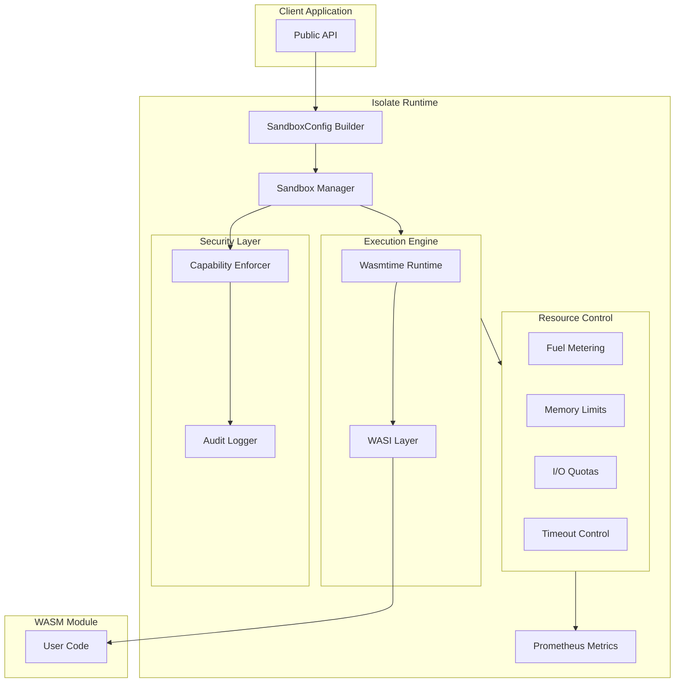

# Introduction

**Isolate** is a lightweight, secure sandbox runtime written in Rust for executing untrusted WebAssembly (WASM) code with strong isolation guarantees.

## Why Isolate?

Modern applications often need to execute untrusted code safely:

- **Plugin Systems**: Run third-party plugins without risking the host application
- **Serverless Functions**: Execute user-provided code in multi-tenant environments
- **Code Sandboxing**: Safely run code snippets for testing, education, or CI/CD
- **Edge Computing**: Deploy lightweight, isolated workloads close to users

Isolate provides a secure foundation for these use cases by combining:

1. **WebAssembly Isolation** - Memory-safe, sandboxed execution
2. **Capability-Based Security** - Fine-grained permission control
3. **Resource Limits** - Prevent runaway CPU, memory, and I/O usage
4. **Production-Ready Tooling** - Metrics, tracing, and audit logging

## Key Features

### Fast Cold Start

Isolate achieves **&lt;5ms sandbox creation time**, making it suitable for latency-sensitive applications. Compare this to 125ms+ for microVM-based solutions.

### Memory Safety

Written entirely in safe Rust (with minimal `unsafe` in dependencies), Isolate eliminates entire classes of vulnerabilities like buffer overflows and use-after-free bugs.

### Multi-Language Support

Any language that compiles to WebAssembly can run in Isolate:

- Rust
- C/C++
- Go
- AssemblyScript
- Python (via PyPy or MicroPython)
- And many more...

### Capability-Based Security

Unlike traditional sandboxing, Isolate uses a **default-deny** security model. Code has no capabilities unless explicitly granted:

```rust
let config = SandboxConfig::builder()
    .module(&wasm_bytes)?
    .capability(Capability::filesystem_read("/data"))  // Read /data only
    .capability(Capability::http_client(vec!["api.example.com"]))  // HTTP to one host
    .build()?;
```

### Resource Limits

Prevent denial-of-service attacks with built-in resource controls:

- **CPU**: Fuel-based instruction metering
- **Memory**: Heap and stack limits
- **Time**: Wall-clock and CPU time limits
- **I/O**: Read and write byte quotas

## Who Uses Isolate?

Isolate is designed for:

- **Platform Engineers** building serverless or edge computing platforms
- **Security Engineers** implementing secure plugin systems
- **Application Developers** running untrusted user code

## Architecture Overview



## Getting Started

Ready to dive in? Start with the [Quick Start](./getting-started/quick-start) guide to run your first sandboxed WASM module.

## Project Status

Isolate is currently at version **0.1.x** and is suitable for experimentation and early adoption. The API may change between minor versions until 1.0.

See the [Changelog](./changelog) for recent updates.
