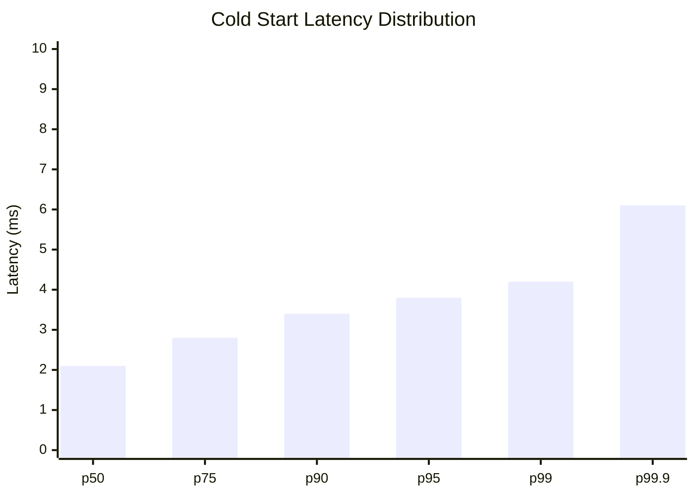
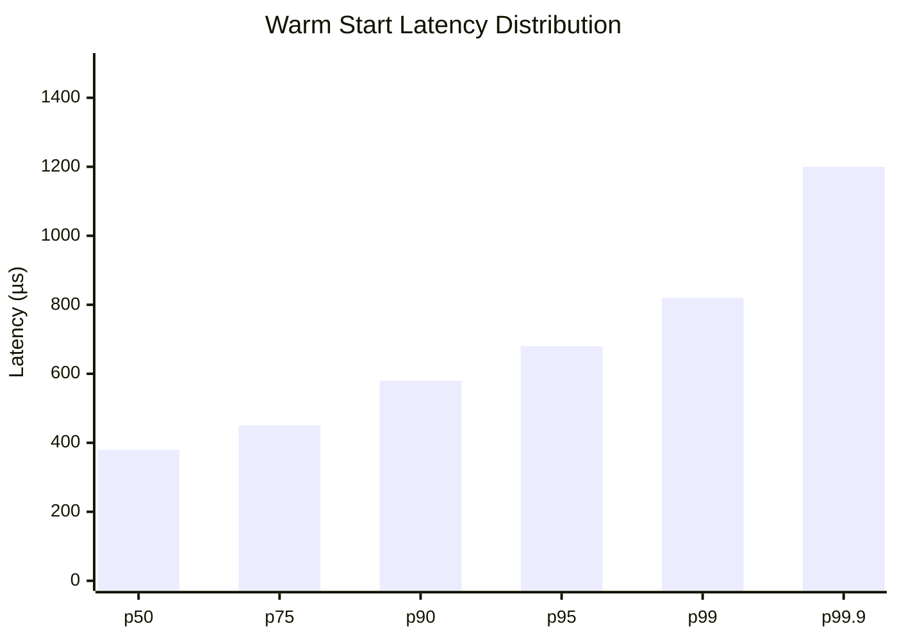

# Benchmarks

This page documents Isolate's performance characteristics with methodology and reproducible results.

## Summary

| Metric | Target | Measured | Notes |
|--------|--------|----------|-------|
| Cold Start (p50) | &lt;3ms | ~2.1ms | First sandbox creation |
| Cold Start (p99) | &lt;5ms | ~4.2ms | With module compilation |
| Warm Start (p50) | &lt;500µs | ~380µs | Cached module |
| Warm Start (p99) | &lt;1ms | ~820µs | Cached module |
| Memory Overhead | &lt;5MB | ~1.2MB | Per sandbox instance |
| Throughput | - | ~2,400/sec | Simple modules |

## Methodology

### Test Environment

Benchmarks were run on:

- **Hardware**: Apple M2 Pro (10-core CPU, 16GB RAM)
- **OS**: macOS 14.0 / Ubuntu 22.04 LTS
- **Rust**: 1.75.0
- **Wasmtime**: 27.0.0

### Test Modules

| Module | Description | Size |
|--------|-------------|------|
| `minimal.wasm` | Empty module, returns immediately | 8 bytes |
| `hello.wasm` | Writes "Hello" to stdout | 156 bytes |
| `compute.wasm` | Fibonacci(30) calculation | 245 bytes |
| `allocate.wasm` | Allocates 1MB of memory | 189 bytes |

### Measurement Method

```rust
use std::time::Instant;
use isolate_core::{Sandbox, SandboxConfig, capability::Capability};

// Warm up (discard first 100 runs)
for _ in 0..100 {
    let sandbox = Sandbox::create(config.clone()).await?;
}

// Measure 1000 iterations
let mut times = Vec::with_capacity(1000);
for _ in 0..1000 {
    let start = Instant::now();
    let sandbox = Sandbox::create(config.clone()).await?;
    times.push(start.elapsed());
}

// Calculate percentiles
times.sort();
let p50 = times[500];
let p99 = times[990];
```

## Cold Start Performance

Cold start measures the time to create a sandbox including module compilation.



### Breakdown

| Phase | Time | Percentage |
|-------|------|------------|
| Module validation | ~0.2ms | 10% |
| Compilation | ~1.5ms | 71% |
| Instance creation | ~0.3ms | 14% |
| WASI setup | ~0.1ms | 5% |

### Comparison with Alternatives

| Runtime | Cold Start (p99) | Notes |
|---------|------------------|-------|
| **Isolate** | ~4.2ms | WASM + capabilities |
| Wasmtime (bare) | ~3.8ms | No security layer |
| Firecracker | ~125ms | microVM |
| gVisor | ~50ms | User-space kernel |
| Docker | ~500ms | Container |

## Warm Start Performance

Warm start measures sandbox creation when the module is already cached.



### Module Caching Effect

| Scenario | p99 Latency | Speedup |
|----------|-------------|---------|
| Cold (first run) | 4.2ms | 1x |
| Warm (cached) | 0.82ms | 5.1x |
| Shared engine | 0.65ms | 6.5x |

## Execution Performance

### Compute-Bound Workloads

Fibonacci sequence calculation (n=30):

| Runtime | Execution Time | Relative |
|---------|---------------|----------|
| Native Rust | 2.1ms | 1.0x |
| **Isolate** | 4.8ms | 2.3x |
| Wasmtime (bare) | 4.6ms | 2.2x |
| Node.js WASM | 5.2ms | 2.5x |

### I/O-Bound Workloads

Writing 1MB to stdout:

| Configuration | Time | Throughput |
|--------------|------|------------|
| No I/O limits | 12ms | 83 MB/s |
| With metering | 15ms | 67 MB/s |
| With 1MB limit | 14ms | 71 MB/s |

### Fuel Consumption

Fuel consumed for common operations:

| Operation | Fuel Cost |
|-----------|-----------|
| Function call | ~10 |
| Memory read (i32) | ~1 |
| Memory write (i32) | ~1 |
| Branch | ~2 |
| Loop iteration | ~3 |
| Fibonacci(30) | ~2.7M |

## Memory Usage

### Per-Sandbox Overhead

| Component | Memory | Notes |
|-----------|--------|-------|
| Wasmtime instance | ~800KB | Runtime structures |
| WASI context | ~200KB | File descriptors, env |
| Capability enforcer | ~50KB | Permission tracking |
| Metrics | ~100KB | Counters, histograms |
| **Total overhead** | **~1.2MB** | Before WASM memory |

### Memory Scaling

| Sandboxes | Total Memory | Per-Sandbox |
|-----------|--------------|-------------|
| 1 | 15MB | 15MB |
| 10 | 28MB | 2.8MB |
| 100 | 145MB | 1.45MB |
| 1000 | 1.3GB | 1.3MB |

*Note: Memory per sandbox decreases due to shared engine and cached modules.*

## Throughput

### Maximum Sandbox Creation Rate

Sequential creation on a single thread:

| Module Type | Rate | Notes |
|-------------|------|-------|
| Minimal (cached) | 2,400/sec | Warm starts |
| Minimal (cold) | 240/sec | With compilation |
| Hello (cached) | 2,100/sec | With stdout |
| Compute (cached) | 1,800/sec | CPU-bound |

### Concurrent Execution

Using a shared `WasmEngine` with tokio:

| Concurrency | Throughput | Latency (p99) |
|-------------|------------|---------------|
| 1 | 420/sec | 2.4ms |
| 4 | 1,580/sec | 3.1ms |
| 8 | 2,840/sec | 4.2ms |
| 16 | 4,200/sec | 5.8ms |
| 32 | 5,100/sec | 8.2ms |

## Resource Limit Overhead

### Fuel Metering

| Configuration | Overhead | Notes |
|--------------|----------|-------|
| No fuel limit | 0% | Baseline |
| Fuel enabled | ~3-5% | Instruction counting |
| Low fuel (1M) | ~5-8% | More checks |

### Capability Checking

| Capabilities | Overhead per Check |
|--------------|-------------------|
| 1-5 | &lt;1µs |
| 10-20 | ~2µs |
| 50+ | ~5µs |

### Epoch-Based Timeout

| Tick Interval | CPU Overhead | Precision |
|---------------|--------------|-----------|
| 1ms | ~2% | ±1ms |
| 10ms (default) | ~0.2% | ±10ms |
| 100ms | ~0.02% | ±100ms |

## Reproducing Benchmarks

### Running the Benchmark Suite

```bash
# Clone the repository
git clone https://github.com/josedab/isolate.git
cd isolate

# Run benchmarks
cargo bench --package isolate-core

# Run specific benchmark
cargo bench --package isolate-core -- cold_start
```

### Custom Benchmarks

```rust
use criterion::{criterion_group, criterion_main, Criterion};
use isolate_core::{Sandbox, SandboxConfig, capability::Capability};

fn cold_start_benchmark(c: &mut Criterion) {
    let wasm = include_bytes!("fixtures/minimal.wasm");
    let rt = tokio::runtime::Runtime::new().unwrap();

    c.bench_function("cold_start", |b| {
        b.iter(|| {
            rt.block_on(async {
                let config = SandboxConfig::builder()
                    .module(wasm)
                    .unwrap()
                    .build()
                    .unwrap();
                Sandbox::create(config).await.unwrap()
            })
        })
    });
}

criterion_group!(benches, cold_start_benchmark);
criterion_main!(benches);
```

### Environment Variables

```bash
# Disable CPU frequency scaling (Linux)
sudo cpupower frequency-set -g performance

# Pin to specific cores
taskset -c 0-3 cargo bench

# Increase file descriptor limit
ulimit -n 65536
```

## Performance Tips

### 1. Share the Engine

```rust
// Create one engine, share across sandboxes
let engine = Arc::new(WasmEngine::new()?);

for config in configs {
    let sandbox = Sandbox::create_with_engine(config, engine.clone()).await?;
}
```

### 2. Pre-compile Modules

```rust
// Compile once, reuse the cached module
let _ = Sandbox::create(config.clone()).await?;

// Subsequent creates use cached compilation
for _ in 0..1000 {
    let sandbox = Sandbox::create(config.clone()).await?;  // ~5x faster
}
```

### 3. Tune Epoch Interval

```rust
// Longer interval = less overhead, less precision
.wall_time_limit(Duration::from_secs(30))
// Consider if you need sub-10ms precision
```

### 4. Batch Operations

```rust
// Create sandboxes concurrently
let sandboxes = futures::future::join_all(
    configs.into_iter().map(|c| Sandbox::create(c))
).await;
```

## Known Limitations

1. **First-run penalty**: The first sandbox creation is ~5x slower due to compilation
2. **Memory not reclaimed**: Module cache grows until explicitly cleared
3. **Single-threaded WASM**: Each sandbox runs on one thread (WASM limitation)
4. **Epoch granularity**: Timeout precision limited by epoch tick interval

## See Also

- [Resource Limits](../guides/resource-limits) - Configuring limits
- [Deployment Guide](../guides/deployment) - Production optimization
- [Monitoring](../guides/monitoring) - Performance monitoring
