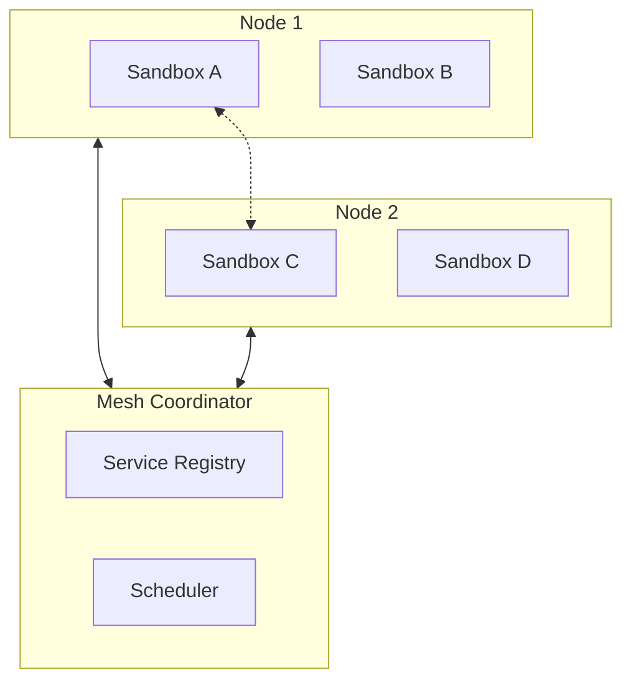

# Experimental Features

Isolate includes several experimental modules that are under active development. These modules are exported for early feedback and experimentation but are **not production-ready**. Their APIs may change significantly in future releases.

:::warning
Do not rely on experimental features for production workloads. APIs are unstable and may change or be removed without notice.
:::

## Overview

| Module | Description | Status |
|--------|-------------|--------|
| `gpu` | WebGPU sandboxed compute | Simplified simulation |
| `mesh` | Distributed sandbox clustering | Network stubs only |
| `enclave` | TEE integration (SGX/SEV/TrustZone) | Simulated TEE |
| `hotpatch` | Hot code patching | Simulation only |
| `verify` | Formal verification | Simplified methods |
| `security` | Linux seccomp/Landlock | Skeleton implementation |

## GPU Module

The `gpu` module provides a sandboxed interface to WebGPU compute capabilities, allowing WASM modules to offload compute-intensive tasks to the GPU while maintaining isolation.

### Current Status

The current implementation is a **simplified simulation** that does not actually execute on GPU hardware. It's designed to:

- Establish the API surface for future GPU integration
- Allow testing of GPU-dependent code paths
- Provide a fallback for environments without GPU access

### Planned Features

- WebGPU compute shader execution
- Memory isolation between GPU and WASM sandbox
- Resource limits for GPU memory and compute time
- Multi-tenant GPU sharing

### Example (Future API)

```rust
use isolate_core::experimental::gpu::{GpuCapability, GpuConfig};

let config = SandboxConfig::builder()
    .module(&wasm_bytes)?
    .capability(Capability::Gpu(GpuCapability::Compute {
        max_buffer_size: 256 * 1024 * 1024,  // 256MB
        max_dispatch_size: 65535,
    }))
    .build()?;
```

## Mesh Module

The `mesh` module enables distributed sandbox clustering, allowing sandboxes to communicate across a network of Isolate nodes.

### Current Status

The current implementation contains **network stubs only**. The mesh protocol and coordination logic are not yet implemented.

### Planned Features

- Service discovery and node registration
- Distributed sandbox scheduling
- Cross-node sandbox communication
- Fault tolerance and failover
- Load balancing

### Architecture (Planned)



## Enclave Module

The `enclave` module provides integration with Trusted Execution Environments (TEEs) including Intel SGX, AMD SEV, and ARM TrustZone.

### Current Status

The current implementation is a **simulated TEE** that mimics the enclave API without actual hardware protection. This allows development and testing of enclave-aware code.

### Planned Features

- Intel SGX enclave creation and attestation
- AMD SEV encrypted memory support
- ARM TrustZone integration
- Remote attestation protocols
- Sealed storage

### Security Model (Planned)

When fully implemented, the enclave module will provide:

1. **Code confidentiality** - WASM module bytecode encrypted at rest
2. **Data confidentiality** - Runtime memory protected from host
3. **Attestation** - Cryptographic proof of enclave integrity
4. **Sealed storage** - Persistent secrets bound to enclave identity

### Example (Future API)

```rust
use isolate_core::experimental::enclave::{EnclaveConfig, AttestationReport};

let config = SandboxConfig::builder()
    .module(&wasm_bytes)?
    .enclave(EnclaveConfig {
        platform: EnclavePlatform::Sgx,
        debug_mode: false,
        sealed_data_path: Some("/var/lib/isolate/sealed"),
    })
    .build()?;

// After creation, obtain attestation report
let report: AttestationReport = sandbox.get_attestation_report().await?;
```

## Hotpatch Module

The `hotpatch` module enables hot code patching of running sandboxes without restart.

### Current Status

The current implementation is **simulation only** and does not perform actual code replacement.

### Planned Features

- Live WASM module replacement
- State preservation across patches
- Rollback on patch failure
- Version tracking
- Patch validation before application

### Use Cases

- Zero-downtime updates for long-running sandboxes
- Security patches without restart
- A/B testing of module versions
- Gradual rollout of changes

## Verify Module

The `verify` module provides formal verification capabilities for WASM modules.

### Current Status

The current implementation contains **simplified verification methods** that perform basic static analysis.

### Current Capabilities

- Basic type checking
- Simple control flow analysis
- Import/export validation

### Planned Features

- Memory safety proofs
- Information flow analysis
- Resource usage bounds verification
- Custom property verification via specifications
- Integration with external verification tools (e.g., Creusot, Kani)

### Example

```rust
use isolate_core::experimental::verify::{VerificationResult, verify_module};

let result: VerificationResult = verify_module(&wasm_bytes)?;

match result {
    VerificationResult::Safe { properties } => {
        println!("Module verified safe: {:?}", properties);
    }
    VerificationResult::Unsafe { violations } => {
        for v in violations {
            eprintln!("Violation: {}", v);
        }
    }
    VerificationResult::Unknown { reason } => {
        println!("Could not verify: {}", reason);
    }
}
```

## Security Module

The `security` module provides OS-level security hardening using Linux seccomp-bpf and Landlock LSM.

### Current Status

The current implementation is a **skeleton** with the API defined but minimal functionality.

### Planned Features

- **seccomp-bpf**: System call filtering to restrict the Isolate process
- **Landlock**: Filesystem access control for the host process
- **Namespaces**: User, network, and mount namespace isolation
- **cgroups v2**: Resource limits at the process level

### Defense in Depth

The security module complements WASM sandboxing with OS-level isolation:

```
┌─────────────────────────────────────┐
│           Application               │
├─────────────────────────────────────┤
│         Isolate Runtime             │
│  ┌───────────────────────────────┐  │
│  │    WASM Sandbox (Wasmtime)    │  │
│  │  ┌─────────────────────────┐  │  │
│  │  │     User WASM Code      │  │  │
│  │  └─────────────────────────┘  │  │
│  └───────────────────────────────┘  │
├─────────────────────────────────────┤
│  seccomp-bpf │ Landlock │ cgroups   │
├─────────────────────────────────────┤
│           Linux Kernel              │
└─────────────────────────────────────┘
```

### Example (Future API)

```rust
use isolate_core::experimental::security::{SeccompPolicy, LandlockRules};

// Configure OS-level security (Linux only)
let security = SecurityConfig::builder()
    .seccomp(SeccompPolicy::Strict)
    .landlock(LandlockRules::new()
        .allow_read("/lib")
        .allow_read("/usr/lib")
        .allow_write("/tmp/isolate"))
    .build()?;

let config = SandboxConfig::builder()
    .module(&wasm_bytes)?
    .os_security(security)
    .build()?;
```

## Enabling Experimental Features

Experimental features are gated behind feature flags. Enable them in your `Cargo.toml`:

```toml
[dependencies]
isolate-core = { version = "0.1", features = ["experimental"] }

# Or enable specific experimental modules
isolate-core = { version = "0.1", features = ["experimental-gpu", "experimental-enclave"] }
```

## Contributing to Experimental Features

We welcome contributions to experimental modules. If you're interested in helping develop these features:

1. Check the [GitHub Issues](https://github.com/josedab/isolate/issues) for open tasks
2. Join the discussion in [GitHub Discussions](https://github.com/josedab/isolate/discussions)
3. See the [Contributing Guide](../contributing) for development setup

### Priority Areas

- GPU compute integration with wgpu
- SGX SDK integration for enclave support
- Landlock and seccomp-bpf implementation
- Formal verification tooling integration

## Feedback

Your feedback on experimental features is valuable. Please:

- Report bugs via [GitHub Issues](https://github.com/josedab/isolate/issues)
- Suggest improvements in [Discussions](https://github.com/josedab/isolate/discussions)
- Share your use cases to help prioritize development
